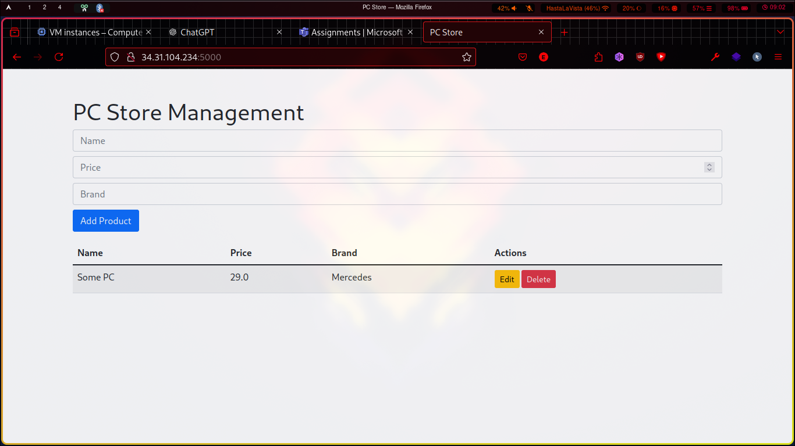
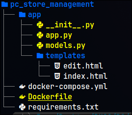
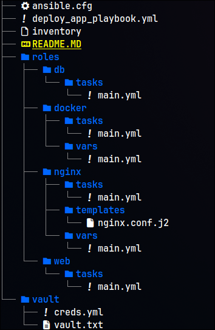
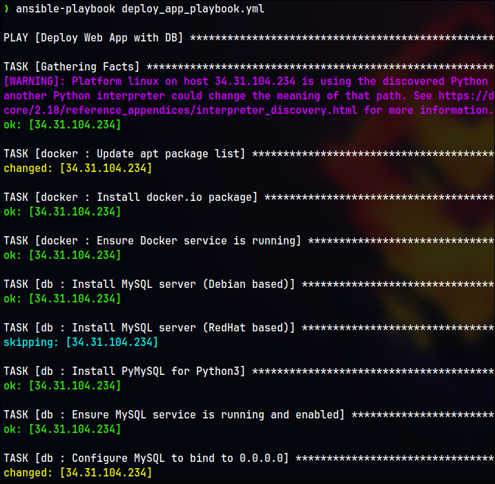
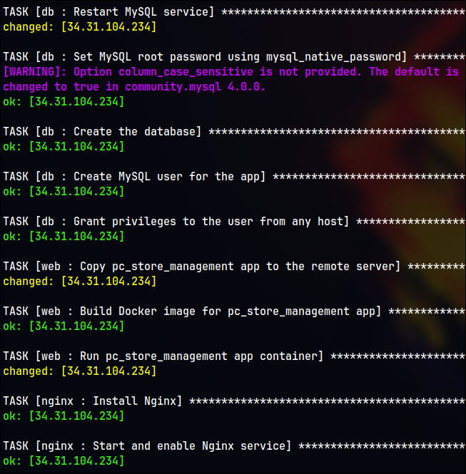
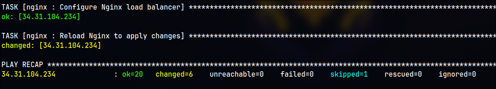

# Documentation

## PC Store Web App

This project provides a simple **PC Store** web application that allows users to **add, remove, and view PCs** along with their details. The application is built using **Flask** for the web framework and **MySQL** as the database backend.



### Functionality

The application allows users to:

- Add new PCs to the store.
- View detailed information about each PC.
- Remove PCs from the store.

This functionality provides a simple inventory management system for a PC store.

### Tech Stack

The application uses the following technologies:

- **Flask**: A micro web framework for building the application.
- **MySQL**: A relational database to store information about PCs.
- **Docker**: To containerize the application and simplify deployment.
- **Docker Compose**: To manage multi-container Docker applications.

### Application Architecture

The project is structured as follows:



### Dockerization

The web application and MySQL database are containerized using Docker to ensure an isolated, consistent, and portable development environment.

#### Dockerfile

The `Dockerfile` describes the setup for building the Docker image for the Flask application.

```dockerfile
# Use official Python image as base
FROM python:3.9-slim

# Set working directory inside the container
WORKDIR /app

# Copy the requirements.txt file into the container
COPY requirements.txt .

# Install dependencies
RUN pip install -r requirements.txt

# Copy the rest of the application files
COPY . .

# Command to run the Flask app
CMD ["python", "app/app.py"]
```

#### Docker Compose

`docker-compose.yml` defines the services required for the app, including the web application and the MySQL database.

```yaml
version: '3.8'

services:
  db:
    image: mysql:latest
    environment:
      MYSQL_ROOT_PASSWORD: ${DB_PASSWORD}
      MYSQL_USER: ${DB_USER}
      MYSQL_PASSWORD: ${DB_PASSWORD}
      MYSQL_DATABASE: ${DB_NAME}
    ports:
      - "3306:3306"
    networks:
      backend:
        ipv4_address: 172.20.0.2

  web:
    build: .
    environment:
      - FLASK_APP=app.py
      - DB_NAME=${DB_NAME}
      - DB_USER=${DB_USER}
      - DB_PASSWORD=${DB_PASSWORD}
      - DB_HOST=172.20.0.2
    ports:
      - "5000:5000"
    depends_on:
      - db
    restart: always
    networks:
      backend:
        ipv4_address: 172.20.0.3

networks:
  backend:
    ipam:
      config:
        - subnet: 172.20.0.0/16

volumes:
  db_data:
```

### Configuration with Environment Variables

Before running the application, ensure that you set the following environment variables in a `.env` file:

```bash
DB_PASSWORD=<your_password>
DB_USER=<your_db_user>
DB_NAME=<your_db_name>
```

### Running the Application

To start the application using Docker Compose:

1. Modify your `.env` file with the required database credentials.
2. Run the following command to launch the containers:

```bash
docker-compose up -d
```

This command starts the web application and MySQL database in detached mode (`-d`), and you can access the web application on [http://localhost:5000](http://localhost:5000).

### Troubleshooting

- If you encounter issues with MySQL connection, ensure the environment variables in the `.env` file are correct.
- Check the container logs for more details using:

```bash
docker-compose logs
```

Here's a detailed and organized documentation for your Ansible configuration:

---

## Ansible Configuration

This project leverages **Ansible** to automate the deployment of a web application with MySQL, Docker, and Nginx. The configuration includes **roles** for each service, and a central **playbook** to orchestrate the deployment across one or more servers.



## Structure

The project is organized as follows:

```plaintext
.
├── ansible.cfg                # Ansible configuration file
├── deploy_app_playbook.yml    # Main playbook for deploying the app
├── inventory                  # Hosts inventory file
├── README.md                  # Project documentation
├── roles                      # Roles to define tasks for each component
│   ├── db                     # MySQL tasks
│   ├── docker                 # Docker tasks
│   ├── nginx                  # Nginx tasks
│   ├── web                    # Web app tasks
└── vault                      # Vault for secrets management
```

## Server Setup

You will need a user on remote machine which is in sudo group and has public key auth.

## Vault

The **Vault** directory stores sensitive credentials, such as database passwords and user credentials. These values are encrypted using Ansible's Vault feature for added security.

- **`creds.yml`**: Contains the credentials used during deployment, such as database password, user, and name.
- **`vault.txt`**: The password for accessing the vault file. This should be kept secure.

`vault/creds.yml`:

```yml
DB_PASSWORD: 
DB_USER: 
DB_NAME: 
ansible_become_password:
```

## Roles

Each service (MySQL, Docker, Web, and Nginx) is encapsulated in a **role**, which contains tasks and variables specific to the service.

### Docker Role

The Docker role ensures that Docker is installed and running on the target servers. It also manages Docker containers for the web application.

- **Main Tasks (`roles/docker/tasks/main.yml`)**:
  - Update the package list
  - Install Docker
  - Ensure Docker service is running and enabled

### DB Role

The **DB** role handles the installation and configuration of MySQL, including setting up the root password, creating the database, and granting user privileges.

- **Main Tasks (`roles/db/tasks/main.yml`)**:
  - Install MySQL server (Debian/RedHat)
  - Install required Python packages for MySQL
  - Configure MySQL to bind to `0.0.0.0` for external access
  - Set the MySQL root password
  - Create the necessary database and users
  - Grant privileges to the app user

### Web Role

The **Web** role is responsible for deploying the application to the server, building the Docker image for the web app, and running the container.

- **Main Tasks (`roles/web/tasks/main.yml`)**:
  - Copy the application code to the target server
  - Build the Docker image for the web app
  - Start the Docker container for the web app

#### Nginx Role (Bonus)

The **Nginx** role configures Nginx as a reverse proxy for the web application, forwarding traffic from port 80 to the Flask app running on port 5000.

- **Main Tasks (`roles/nginx/tasks/main.yml`)**:
  - Install and start Nginx
  - Configure the Nginx server to reverse proxy traffic
  - Reload Nginx to apply changes

- Additionally, it incledes **Nginx Configuration Template (`roles/nginx/templates/nginx.conf.j2`)**

#### Playbook and Its Run

The **`deploy_app_playbook.yml`** is the main playbook that ties together the roles and orchestrates the deployment of the web app.

```yaml
- name: Deploy Web App with DB
  hosts: all
  become: yes
  vars_files:
    - vault/creds.yml
  roles:
    - docker
    - db
    - web
    - nginx
```

To run the playbook:

1. Ensure you have an inventory file that defines the target server(s).
2. Set up your **Vault** to store the credentials securely.
3. Run the playbook using:

```bash
ansible-playbook deploy_app_playbook.yml
```

### Results

The playbook will ensure the following:

- **Docker** is installed and running.
- **MySQL** is configured and accessible externally.
- The **web app** is deployed and running in a Docker container.
- **Nginx** acts as a Load Balancer.






